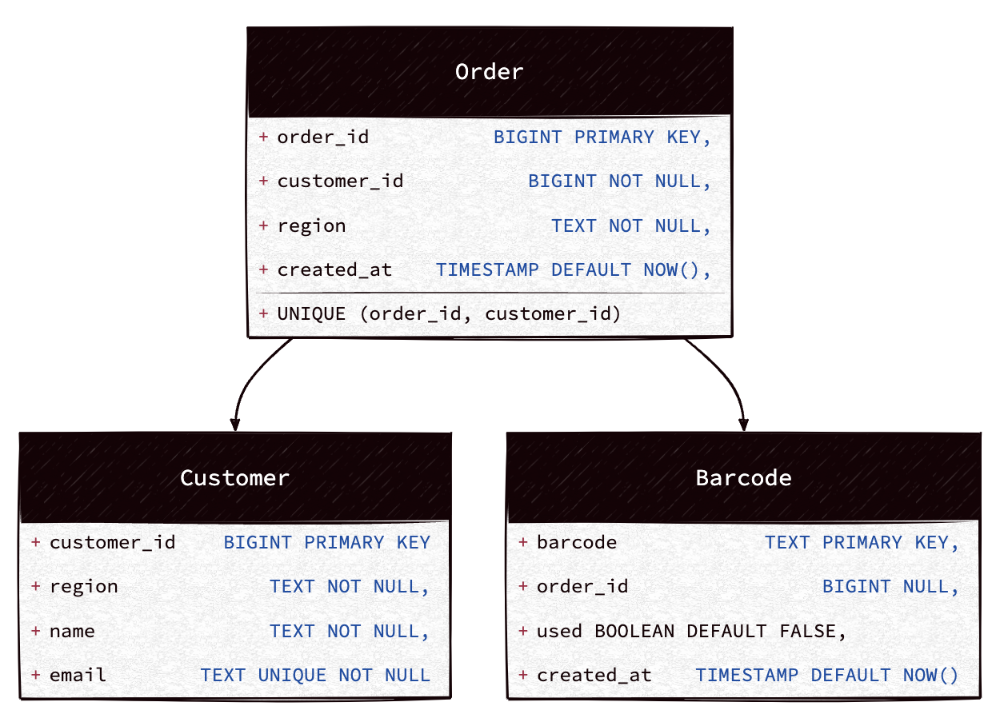

# Tiqets Vouchers (Alireza Khosravian)

## Features

- **Asynchronous I/O**: Utilizes `asyncio` for non-blocking data processing.
- **Separation of Concerns**: Clear abstractions for better maintainability and scalability.
- **Optimized Algorithms**: Designed for efficiency in terms of time complexity.
- **Poetry as the Package Manager**: Dependency management is handled with [Poetry](https://python-poetry.org/).
- **Github Actions**: CI pipelined using Github Actions to make sure about Code Quality.

## In Memory Storage Strategy

HashMap and Set for Fast Lookups and Guarantee uniqueness
   - **Orders to Customers**: HashMap (dict)
   - **Customer to Barcodes**: HashMap (dict)
   - **Used Barcodes**: Set
   - **Unused Barcodes**: Set

## DataBase Storage Strategy

### requirements:

- **Orders and Customers**: 
  - CAP theorem: Consistency >> Availability
  - why? Orders and customers require strong consistency, ensuring data integrity
- **Tickets Data**: 
  - CAP theorem: availability  >> Consistency
  - why? Tickets normally are read more than booked and their information rarely updates
- Scalability: 
  - Horizontal scalable
  - why? for special events or seasonal requirements like christmas or summer events we need to be able scale system horizontally 

## Approaches
PostgreSQL is an excellent choice for this system because it provides strong consistency, complex query capabilities, and horizontal scalability while ensuring data integrity.

- ✅ Strong Consistency for Orders 
- ✅ High Availability with Replication for Tickets and Indexing for Fast Lookups
- ✅ Horizontal Scalability with Partitioning 

## Data Models




## Suggested Indexes

- INDEX `idx_orders_customer_count` ON `orders (customer_id)`
- INDEX `idx_barcodes_unused` ON `barcodes (used)` WHERE `used = FALSE`
- INDEX `idx_barcodes_barcode` ON `barcodes (barcode)`
- INDEX `idx_barcodes_order` ON `barcodes (order_id)`
- INDEX `idx_orders_customer` ON `orders (customer_id)`

### Tool Specifications

`tiqets-vouchers -h`

|       Field       | Required? |                  Description                  |
|:-----------------:|:---------:|:---------------------------------------------:|
| `--barcodes-file` |    No     | path to barcodes (default: data/barcodes.csv) |
|  `--orders-file`  |    No     |   path to orders (default: data/orders.csv)   |
|  `--output-dir`   |    No     |       path to output (default: output)        |
|     `--debug`     |    No     |         Run the project on debug mode         |
|     `--help`      |    No     |                     help                      |


## How to run the tool?

Prepare the environment

- Install Docker and Docker Compose
- Install Makefile (optional)

Clone the project
```bash
  git clone git@github.com:alirezakhosraviyan/tiqets-vouchers-cli.git
```

```bash
  cd tiqets-vouchers-cli
```
Get into docker container

```bash
  docker build -t tiqets-vouchers:dev --target development . && docker run --rm -it -v ./data:/home/tiqets/input -v ./output:/home/tiqets/output tiqets-vouchers:dev /bin/sh
  
  or
  
  make shell
```

Run the Project
```bash
  poetry run tiqets-vouchers
  
  or
  
  poetry run tiqets-vouchers --help
```

Run tests
```bash
  poetry run pytest
  
  or
  
  make tests
```

Run linters (optional)
```bash
  make check
```
